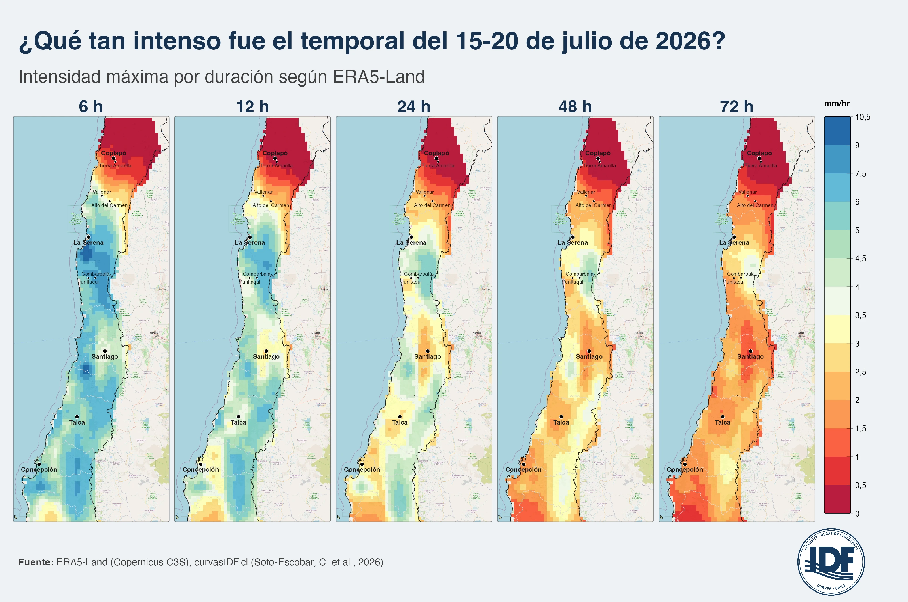
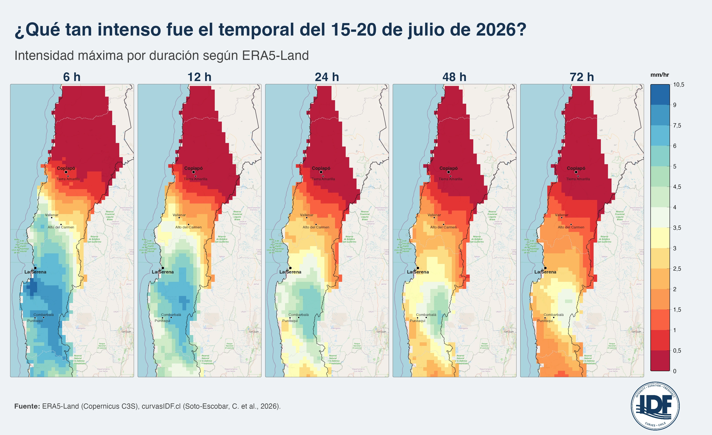
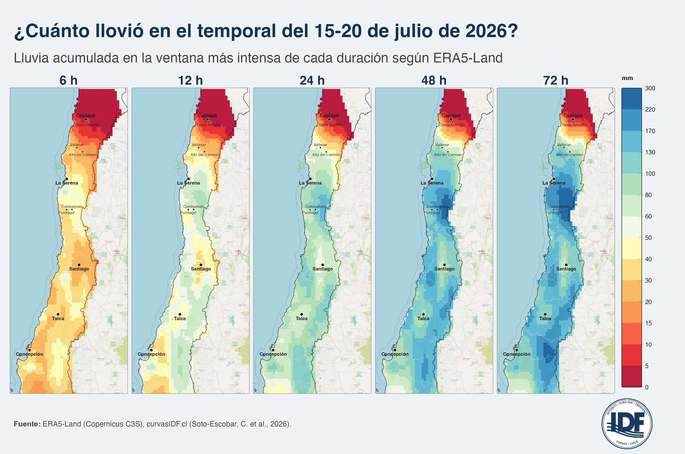
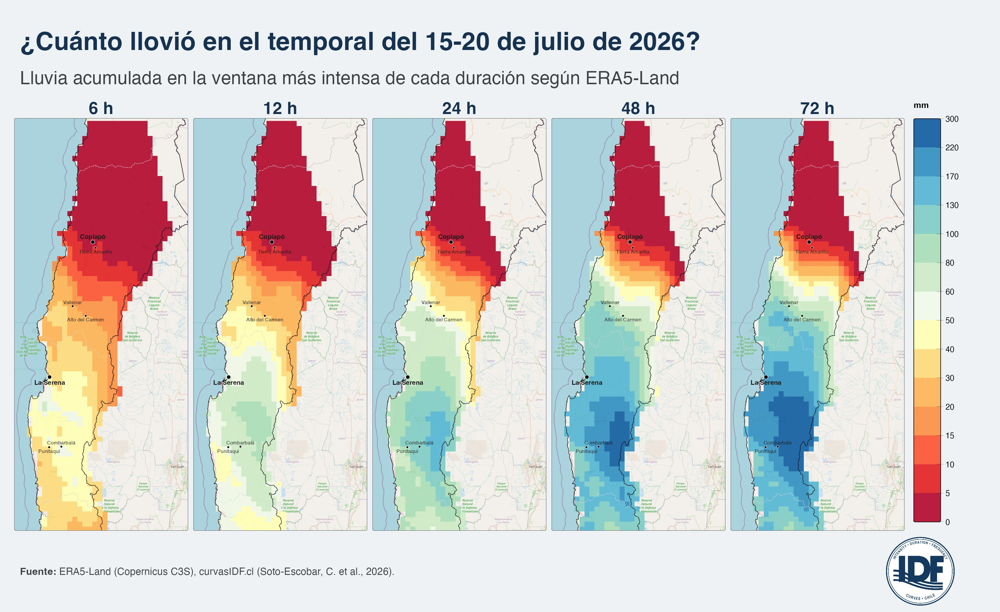
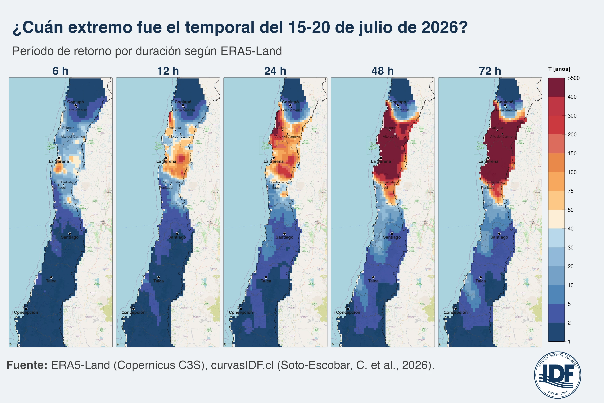
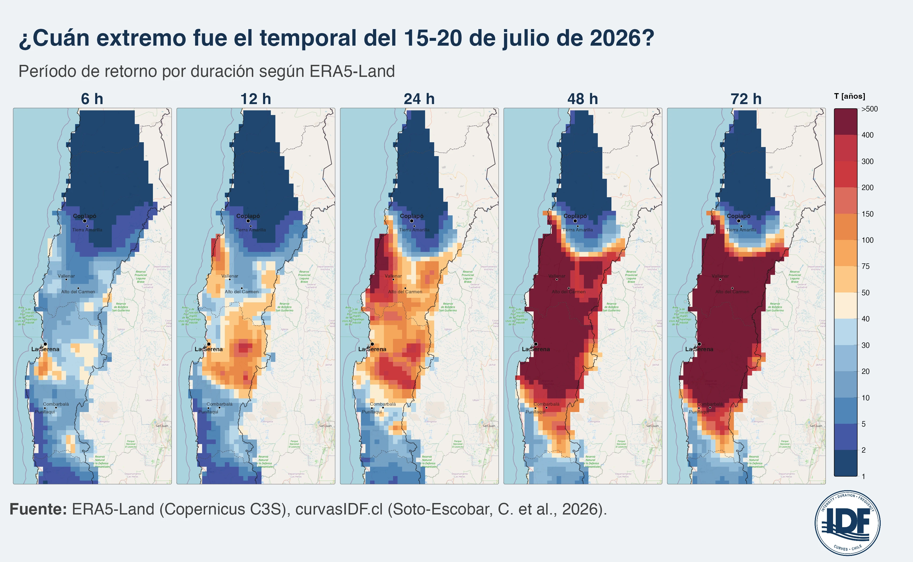
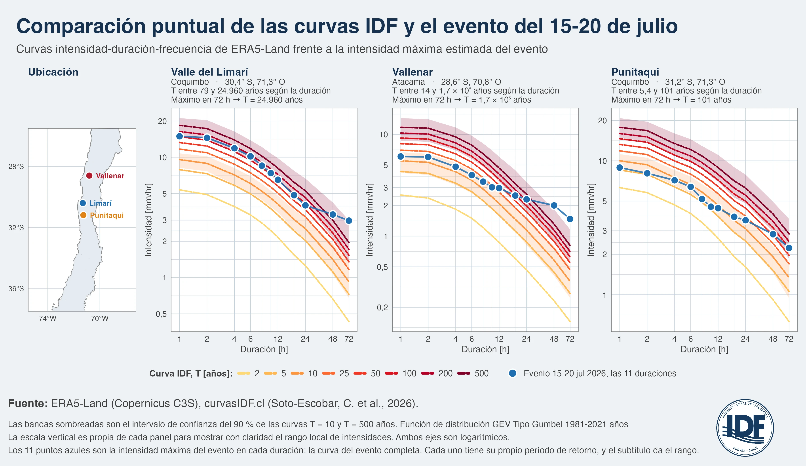
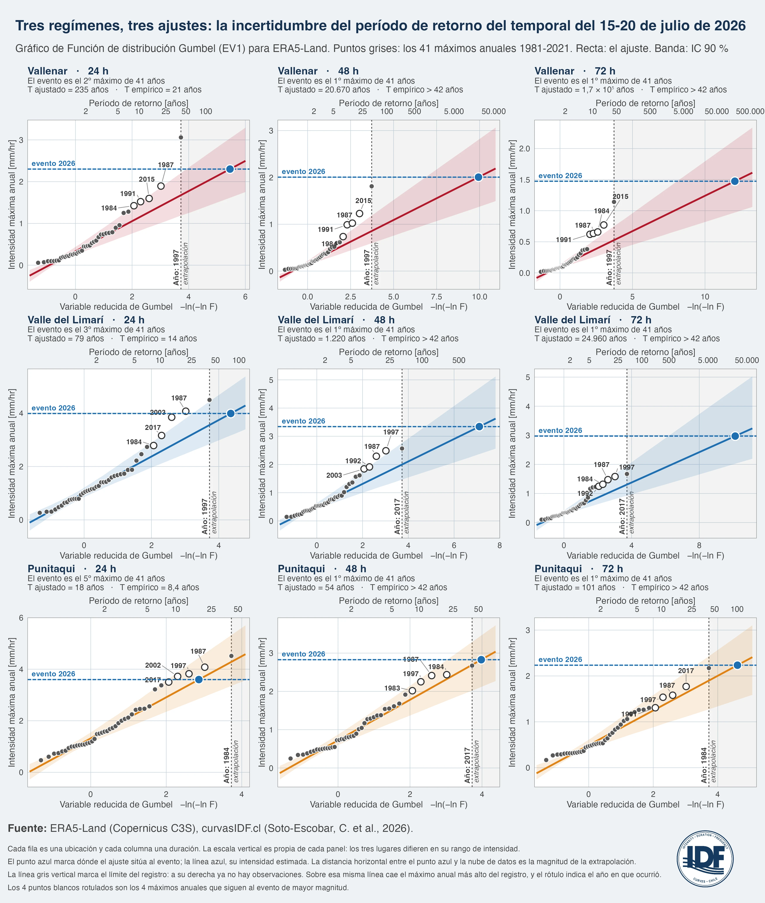
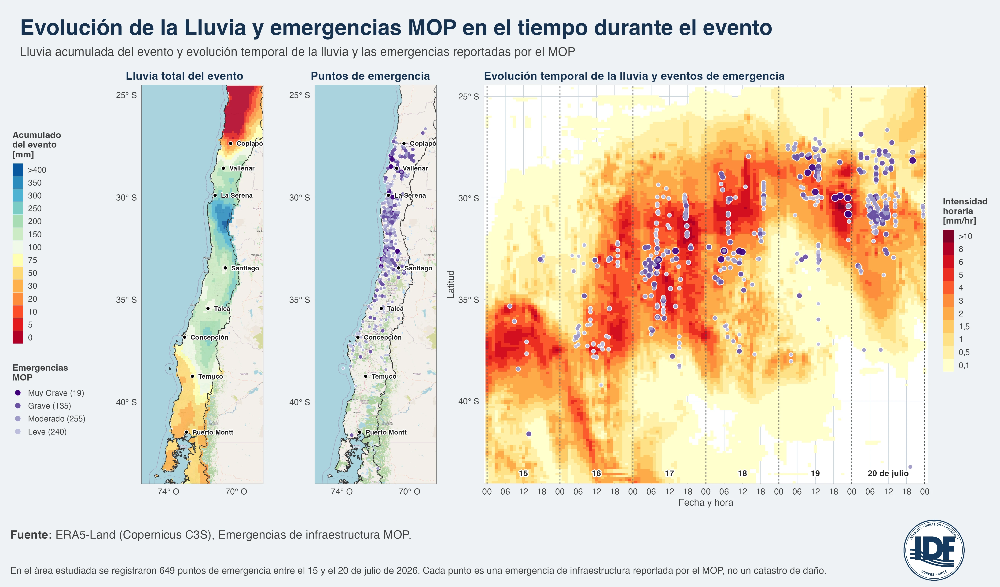

Entre el 15 y el 20 de julio de 2026, un intenso y prolongado temporal dejó precipitaciones persistentes entre Atacama y Ñuble, con una señal especialmente anómala en las regiones de Atacama y Coquimbo. Esta tormenta estuvo potenciada por la presencia de un intenso evento de El Niño, un río atmosférico conectado con el Pacífico tropical, y condiciones atmosféricas favorables para la llegada de tormentas (CR2, 2026; Meteored, 2026).

Este artículo cuantifica el evento en términos de intensidad, acumulación, duración crítica y período de retorno, y conecta esa señal hidrometeorológica con los impactos reportados por SENAPRED, MOP, DGA, SNA y el sector minero.

## 1. ¿Qué tan extremas fueron las precipitaciones en distintos lugares de Chile?

En 72 horas, la versión de acceso provisional y temprano del conjunto de datos climáticos ERA5-Land estimó cerca de 214 milímetros de lluvia en un punto del valle del Limarí, en Coquimbo, y unos 160 milímetros en Punitaqui, apenas 90 kilómetros al sur. Ambas acumulaciones de precipitación son del mismo orden de magnitud, sin embargo, su grado de excepcionalidad es muy distinto. En Punitaqui el análisis de frecuencias, basado en Soto-Escobar et al. (2026), estima 101 años de [período de retorno (T)](https://es.wikipedia.org/wiki/Per%c3%adodo_de_retorno) para este evento. En Limarí en cambio, este evento **superó los 500 años** de período de retorno. Los valores calculados del período de retorno T no representan una cantidad de años exacta de repetición para el evento analizado, sino que nos indica que, en promedio sobre toda la estadística disponible, el evento se repetirá cada T años, y mientras más grande es el valor del período de retorno calculado más extremo es el evento analizado. Los valores típicos de periodos de retorno en obras de drenaje varían entre 2 y 500 años, dependiendo de la importancia de la infraestructura, el riesgo tolerable de falla y la vida útil estimada (Minvu, 2026; MOP, 2025).

El contraste entre los dos períodos de retorno anteriores resume la idea central de este artículo: **la cantidad de lluvia precipitada por sí sola no es suficiente para determinar qué tan excepcional será una tormenta**. Una acumulación elevada puede ser relativamente habitual en un clima lluvioso, pero una cantidad menor puede resultar extraordinariamente alta en una zona árida. El grado de excepcionalidad depende no sólo de la cantidad total de milímetros acumulados, sino también de la duración del evento y de la climatología del lugar.

Un análisis anterior del CR2 explicó la configuración meteorológica del temporal (CR2, 2026). Aquí abordamos algunas preguntas hidrológicas pendientes:

- ¿qué tan anómala fue la lluvia que ocurrió entre Atacama y Ñuble?,

- ¿qué duración de tormenta fue la que hizo que este evento fuera de verdad excepcional?, y

- ¿qué podemos afirmar sobre este evento extremo en relación al comportamiento de las precipitaciones durante el período histórico (1981-2021)?.

## 2. ¿Cómo medimos qué tan anómalo o improbable fue este evento?

Para responder esta pregunta, analizamos la precipitación máxima mediante ventanas móviles de 6, 12, 24, 48 y 72 horas, aplicadas a datos horarios de la versión preliminar de ERA5-Land. En cada celda de la grilla calculamos, para cada duración, la máxima precipitación acumulada observada durante el episodio. Posteriormente, expresamos estos valores como intensidades medias, dividiendo la acumulación por la duración correspondiente.

Esta distinción es importante. La **acumulación** corresponde a la lámina total de precipitación registrada durante una ventana temporal y se expresa en milímetros. La **intensidad media** representa esa misma acumulación dividida por la duración de la ventana y se expresa en milímetros por hora. Un episodio breve puede presentar una intensidad muy elevada y, aun así, acumular menos precipitación que un evento de intensidad moderada que persiste durante varios días.

A continuación, comparamos las intensidades máximas obtenidas para cada duración con las **curvas intensidad-duración-frecuencia** (**IDF**) correspondientes a cada celda. Estas curvas se construyeron a partir de las series de máximos anuales de ERA5-Land para el período 1981-2021, que comprende 41 años, mediante el ajuste de una distribución de valores extremos de Gumbel estacionaria, siguiendo la metodología de [Soto-Escobar et al. (2026)](https://doi.org/10.5194/hess-30-91-2026).

La rareza estadística de cada intensidad se expresa mediante su **período de retorno**, (T). Por ejemplo, un valor de T = 100 años indica que, bajo el modelo probabilístico ajustado y suponiendo condiciones estacionarias, una intensidad de esa magnitud o superior tiene una probabilidad anual de excedencia cercana al 1 %. Esto no significa que el evento ocurra de manera regular una vez cada cien años, ni que su ocurrencia reinicie un intervalo de espera de cien años. Eventos de esa magnitud pueden producirse en años consecutivos o no observarse durante períodos mucho más prolongados.

Los cálculos se realizaron para cada celda del producto ERA5-Land corregido por sesgo, con una resolución espacial de 0.1 grados, equivalente aproximadamente a 11 km en el ecuador. Esta resolución permite caracterizar patrones regionales y comparar espacialmente la severidad del episodio, pero no sustituye las observaciones de una estación pluviográfica ni representa completamente gradientes orográficos, celdas convectivas u otros procesos hidrometeorológicos de escala subgrilla.

Por tanto, los valores obtenidos deben interpretarse como estimaciones espacialmente consistentes para el diagnóstico y la comparación hidrometeorológica regional, y no como mediciones exactas de la precipitación en una localización puntual.

## 3. ¿Cuánto, dónde y con qué intensidad llovió?

La Figura 1 muestra que **uno de los rasgos más relevantes de este temporal fue su duración**, junto con un marcado cambio espacial de los máximos a medida que aumenta la duración analizada. Para una ventana de 6 horas, el valor máximo de precipitación acumulada dentro del área de estudio se localizó en el valle del Limarí, cerca de Ovalle, con aproximadamente 61 mm, equivalentes a una intensidad media de 10,2 mm/h. A medida que se amplía la ventana temporal, los máximos se desplazan progresivamente hacia sectores cordilleranos: alcanzan alrededor de 143 mm en las 24 horas más intensas y aproximadamente 288 mm en la ventana de 72 horas. En otras palabras, los máximos asociados a duraciones cortas se concentraron principalmente en sectores de valle, mientras que los mayores acumulados de larga duración se localizaron hacia la cordillera.

La Figura 1 también permite examinar cómo cambia la **intensidad media máxima** entre las cinco duraciones consideradas. Cada panel representa, para cada celda de la grilla, la ventana continua con mayor precipitación acumulada para una duración determinada, expresada como intensidad media en milímetros por hora. La utilización de una escala común permite comparar directamente las intensidades entre paneles.

Como es esperable, las intensidades medias máximas disminuyen al aumentar la duración de la ventana, porque los pulsos de precipitación más intensos quedan promediados dentro de intervalos progresivamente más largos. En consecuencia, las áreas asociadas a las intensidades más elevadas se reducen y el campo espacial se vuelve más homogéneo. Esta dependencia con la duración es particularmente relevante desde el punto de vista hidrológico y del diseño de infraestructura: sistemas de drenaje urbano o alcantarillas responden principalmente a precipitaciones intensas de corta duración, mientras que la respuesta de cuencas de mayor tamaño, ríos y embalses integra precipitaciones acumuladas durante varias horas o incluso varios días.

La figura muestra además un resultado importante para interpretar la severidad del episodio: **las zonas con las mayores intensidades absolutas no coinciden necesariamente con aquellas donde se estiman los mayores períodos de retorno**. En particular, sectores interiores de Atacama presentan intensidades relativamente bajas, pero pueden corresponder a eventos estadísticamente muy poco frecuentes debido a la climatología local de precipitaciones.

**Figura 1.** *Intensidad media máxima estimada durante el temporal del 15 al 20 de julio de 2026, en milímetros por hora, para ventanas móviles de 6, 12, 24, 48 y 72 horas. Cada panel muestra, para cada celda de la grilla, la ventana continua de su respectiva duración con la mayor precipitación acumulada durante el episodio, expresada como intensidad media. La escala es común a los cinco paneles, por lo que las intensidades pueden compararse directamente entre duraciones. Datos horarios de la versión preliminar de ERA5-Land (Copernicus C3S), corregidos por sesgo.*

La Figura 2 presenta el mismo campo de intensidades máximas, pero con un acercamiento a las regiones de Atacama y Coquimbo. Para la ventana de 6 horas se observa el mayor contraste espacial: el interior de Atacama, particularmente entre Copiapó y Tierra Amarilla, presenta intensidades inferiores a 0.5 mm/h, mientras que sectores costeros e interiores de Coquimbo, entre La Serena y el valle del Limarí, alcanzan valores de hasta aproximadamente 10.5 mm/h.

A medida que aumenta la duración considerada, este contraste disminuye. En la ventana de 72 horas, el interior de Atacama permanece por debajo de 0,5 mm/h, mientras que el sector de Vallenar presenta intensidades medias del orden de 1-2 mm/h. En cambio, sectores próximos a La Serena y Combarbalá, que se encontraban entre los máximos para la ventana de 6 horas, presentan intensidades medias inferiores a aproximadamente 4 mm/h cuando se consideran las 72 horas más lluviosas. Esta reducción no implica una disminución del volumen precipitado, sino el efecto de promediar la precipitación acumulada sobre una ventana temporal considerablemente más extensa.

**Figura 2.** *Intensidades máximas del temporal, en milímetros por hora, para ventanas móviles de 6, 12, 24, 48 y 72 horas, con un acercamiento a las regiones de Atacama y Coquimbo. La escala, la paleta de colores y la fuente de datos son las mismas que en la Figura 1. Datos horarios de la versión preliminar de ERA5-Land (Copernicus C3S), corregidos por sesgo.*

La Figura 3 presenta la **máxima precipitación acumulada** asociada a cada una de las duraciones analizadas. Estos valores corresponden al producto entre la intensidad media máxima mostrada en la Figura 1 y la duración de la respectiva ventana temporal. Por tanto, los cinco paneles representan la cantidad máxima de precipitación acumulada durante cualquier intervalo continuo de 6, 12, 24, 48 o 72 horas dentro del episodio.

El rango de acumulaciones aumenta considerablemente con la duración, desde aproximadamente 61 mm para 6 horas hasta cerca de 288 mm para 72 horas. Por esta razón, los intervalos de la escala de colores se amplían progresivamente utilizando una escala categórica; pues el utilizar intervalos uniformes comprimiría los valores correspondientes a las duraciones más cortas y dificultaría su interpretación espacial.

Esta representación permite apreciar con mayor claridad la importancia de la duración del evento. A medida que aumenta la duración, el núcleo de máximas acumulaciones se desplaza desde sectores de valle hacia zonas cordilleranas y aumenta la superficie afectada por acumulaciones elevadas. El patrón indica que la severidad del episodio no estuvo determinada únicamente por pulsos breves de alta intensidad, sino también por la duración de la precipitación durante períodos prolongados.

**Figura 3.** *Precipitación máxima acumulada, en milímetros, dentro de la ventana más lluviosa de cada duración. Los valores se obtienen multiplicando la intensidad media máxima de la Figura 1 por la duración correspondiente. Los valores mostrados no representan la precipitación total de los seis días del evento, sino el máximo acumulado en cualquier ventana continua de 6, 12, 24, 48 o 72 horas de duración dentro de la tormenta. El instante de inicio de la ventana máxima puede variar en el espacio. Los intervalos de la escala de valores utilizada en la leyenda de la figura se amplían progresivamente para poder capturar el patrón de la distribución espacial de la precipitación acumulada, desde aproximadamente 61 hasta 288 mm. Datos horarios de la versión preliminar de ERA5-Land (Copernicus C3S), corregidos por sesgo.*

La Figura 4 muestra los mismos valores de precipitación máxima acumulada que la Figura 3, pero con foco espacial en las regiones de Atacama y Coquimbo. El interior de Atacama permanece por debajo de aproximadamente 5 mm en las cinco duraciones consideradas. Hacia el sur, en cambio, los acumulados aumentan tanto espacialmente como con la duración de cada ventana temporal. Para 24 horas, sectores próximos a La Serena y al valle del Limarí alcanzan aproximadamente 60-100 mm. En la ventana de 72 horas, amplios sectores entre La Serena, Combarbalá y Punitaqui presentan acumulaciones del orden de 220-300 mm, próximos al máximo regional de aproximadamente 288 mm.

**Figura 4.** *Precipitación máxima acumulada, en milímetros, dentro de la ventana temporal más lluviosa de cada duración, con un foco espacial en las regiones de Atacama y Coquimbo. La escala, la paleta de colores y la fuente de datos son las mismas que en la Figura 3.*

Es importante enfatizar que las Figuras 3 y 4 **no representan la precipitación total acumulada durante los seis días del temporal**. Cada celda muestra el máximo acumulado dentro de una ventana temporal de duración fija, cuyo instante de inicio puede diferir espacialmente. Por tanto, las ventanas máximas de dos celdas vecinas no necesariamente corresponden al mismo intervalo de tiempo.

La precipitación total del evento se presenta posteriormente, en el panel izquierdo de la Figura 9. Mantener esta distinción es fundamental: aunque ambos productos se expresan como precipitación acumulada, responden a preguntas hidrometeorológicas diferentes. Las Figuras 3 y 4 cuantifican la máxima precipitación acumulada para duraciones específicas, mientras que la Figura 9 representa el volumen total precipitado durante el episodio completo.

## 4. ¿En qué lugares este evento fue “sin precedentes”?

Cuando la pregunta cambia desde **cuánto llovió** hacia **cuán excepcional fue con respecto a la climatología local**, el patrón espacial cambia de forma sustancial. En particular, la zona más excepcional se observa en el interior de la provincia de Huasco, en **Atacama**, cerca de los 28°S. Allí se concentran los mayores períodos de retorno estimados para las ventanas de 24, 48 y 72 horas. No corresponde a la zona donde ERA5-Land estimó las mayores intensidades o acumulaciones absolutas, sino a aquella donde la precipitación observada durante el episodio se apartó con mayor magnitud de la distribución climatológica de extremos utilizada como referencia.

**Coquimbo** constituye la segunda zona más excepcional y la región donde esta señal de excepcionalidad alcanzó la mayor extensión espacial. Para la ventana de 48 horas, el 47 % de su superficie presentó períodos de retorno estimados superiores a 500 años; mientras que para 72 horas, esta proporción aumentó al 64 %. Entre **Valparaíso, la Región Metropolitana y O’Higgins**, en cambio, predominó una señal más moderada y espacialmente localizada. En estas regiones, la ventana de 48 horas resultó, en varios sectores, más excepcional que la de 72 horas. Esto recuerda que **el período de retorno no tiene por qué aumentar monotónicamente con la duración de la tormenta**: cada duración posee su propia distribución de intensidades máximas anuales y, por tanto, una climatología de extremos diferente. En **Maule y Ñuble** predominaron períodos de retorno comparativamente bajos, aunque persistieron algunos focos localizados de mayor excepcionalidad.

La Figura 5 muestra el período de retorno estimado para las cinco duraciones analizadas. La escala termina en una categoría abierta de «más de 500 años»: todos los valores que el modelo probabilístico sitúa por encima de ese umbral se agrupan en una clase única. Esta decisión es deliberada. Las curvas utilizadas se ajustaron en base a 41 máximos anuales correspondientes al período 1981-2021, por lo que estimaciones de varios cientos de años implican una extrapolación muy alejada de la longitud efectiva del registro. En consecuencia, no resulta estadísticamente justificable interpretar diferencias entre, por ejemplo, períodos de retorno de 600, 1.000 o varios miles de años como estimaciones precisas. Los mapas muestran que la superficie asociada a períodos de retorno muy elevados aumenta marcadamente en las ventanas de 48 y 72 horas. Este comportamiento indica que, especialmente en el norte árido, **la duración de hasta dos o tres días fue climatológicamente más excepcional que las intensidades máximas asociadas a pulsos de menor duración**. Por ello, el principal valor diagnóstico de estos resultados no está en interpretar literalmente los períodos de retorno más extremos, sino en identificar las zonas donde el episodio se situó muy por encima de la climatología de máximos anuales utilizada para el ajuste y donde la extrapolación estadística y, por tanto su incertidumbre, pasa a ser dominante. Para la ventana de 72 horas, el 20,5 % del área continental analizada queda clasificada por encima del umbral de 500 años.

**Figura 5.** *Período de retorno estimado del temporal, en años, para ventanas temporales móviles de 6, 12, 24, 48 y 72 horas sobre el territorio continental analizado. La escala se extiende desde 1 año hasta una categoría abierta de «más de 500 años», que agrupa todas las estimaciones superiores a ese umbral. Los períodos de retorno se obtuvieron mediante el ajuste de una distribución de Gumbel estacionaria a las series de 41 máximos anuales de ERA5-Land correspondientes al período 1981-2021, siguiendo la metodología de Soto-Escobar et al. (2026). Los valores de la clase superior deben interpretarse como indicadores de excepcionalidad extrema y no como estimaciones precisas de recurrencia.*

La Figura 6 presenta el mismo análisis de la Figura 5 pero con un foco espacial en las regiones de **Atacama y Coquimbo**, donde se concentraron los períodos de retorno más extremos. Esta ampliación permite observar cómo evoluciona espacialmente el período de retorno con la duración considerada. Para 24 horas, la categoría superior de más de 500 años aparece todavía en focos relativamente aislados, principalmente en el interior de Huasco y en sectores próximos a La Serena, rodeados por áreas con períodos de retorno del orden de 50 a 150 años. Para 48 horas, estos focos se expanden y comienzan a conformar una franja de períodos de retorno muy extremos entre Copiapó y el valle del Limarí. En la ventana de 72 horas, la categoría superior se extiende sobre gran parte del interior de ambas regiones y se prolonga hacia el sur hasta sectores próximos a Combarbalá y Punitaqui, donde transiciona hacia períodos de retorno del orden de 100 a 400 años. Más al sur de Punitaqui predominan nuevamente valores inferiores, generalmente por debajo de 20 años para las cinco duraciones consideradas.

Este patrón confirma una característica central del episodio: **los mayores períodos de retorno no coinciden necesariamente con las zonas de mayor precipitación absoluta**. En Atacama, acumulaciones comparativamente modestas pueden corresponder a períodos de retorno muy elevados, debido a la baja frecuencia e intensidad histórica de precipitaciones prolongadas en esta región.

**Figura 6.** *Período de retorno estimado del temporal, en años, para ventanas móviles de 6, 12, 24, 48 y 72 horas, con un foco espacial en las regiones de Atacama y Coquimbo, donde se observaron los periodos de retorno más extremos. Se utiliza la misma escala, fuente de datos y metodología estadística que en la Figura 5. La categoría «más de 500 años» debe interpretarse como una clase abierta de excepcionalidad extrema, dada la incertidumbre inherente a extrapolar una distribución ajustada sobre 41 máximos anuales.*

## 5. ¿Qué incertidumbre presentan estas estimaciones?

Los mapas anteriores muestran los períodos de retorno obtenidos a partir del ajuste probabilístico, pero los valores más elevados de (T) no deben interpretarse como frecuencias directamente observables ni como estimaciones igualmente precisas en todo su rango. El caso de **Vallenar** permite ilustrar esta diferencia. Para una duración de 24 horas, el temporal de 2026 alcanzó una intensidad media de 2,3 mm/h y correspondió al segundo valor más alto entre los 41 máximos anuales analizados, sólo por debajo del máximo de 1997. Utilizando una posición de trazado empírica basada exclusivamente en el orden de los datos, el segundo máximo de una muestra de 41 años corresponde aproximadamente a un período de retorno de 21 años. Sin embargo, la distribución de Gumbel ajustada asigna a esa misma intensidad un período de retorno de aproximadamente 235 años. Esta diferencia no constituye una inconsistencia del cálculo: refleja que ambas estimaciones responden a conceptos distintos. El **período de retorno empírico** depende fundamentalmente de la posición que ocupa el evento dentro de la muestra observada, mientras que el **período de retorno probabilístico** se obtiene a partir de la probabilidad de excedencia asignada por la distribución utilizada. Por ello, ambos valores pueden diferir considerablemente, en especial cuando el tamaño de la muestra es reducido y el evento se encuentra en la cola de la distribución.

La situación anterior resulta particularmente relevante en regiones áridas como Atacama, donde las series de máximos anuales presentan numerosos años con precipitaciones muy pequeñas y unos pocos episodios considerablemente mayores. La posición y la escala estimadas para la distribución Gumbel determinan entonces una cola en la que incrementos relativamente pequeños de intensidad pueden traducirse en grandes variaciones del período de retorno. En este contexto, un valor elevado del período de retorno expresa principalmente que el evento se sitúa muy lejos del comportamiento característico de los máximos anuales; no implica necesariamente que exista evidencia observacional suficiente para estimar con precisión una recurrencia de varios cientos de años. Por esta razón, los períodos de retorno deben interpretarse conjuntamente con la posición del evento dentro del registro observado y con su incertidumbre estadística. El registro indica cuántas observaciones comparables existen efectivamente en los 41 años disponibles; el modelo probabilístico permite extrapolar más allá de ese rango bajo los supuestos de la distribución adoptada. Ambas lecturas son complementarias, pero su grado de respaldo observacional es diferente. La Figura 7 compara las curvas intensidad-duración-frecuencia (IDF) con la trayectoria del temporal en tres localizaciones representativas: Vallenar, el valle del Limarí y Punitaqui. En cada panel, las curvas de colores cálidos representan períodos de retorno entre 2 y 500 años, mientras que los once puntos azules describen las intensidades medias máximas del evento para duraciones comprendidas entre 1 y 72 horas. Esta figura permite visualizar por qué la duración del mismo es determinante para evaluar su excepcionalidad. En Vallenar, las intensidades correspondientes a duraciones de hasta aproximadamente 12 horas permanecen dentro del rango asociado a T ≤ 25 años, pero la curva del evento se separa progresivamente de las curvas IDF a medida que aumenta la duración. Esto indica que la característica más excepcional del temporal en este sector no estuvo dada por pulso breve de gran intensidad, sino por la duración de la precipitación, que se extendió durante varios días. En Punitaqui se observa también un aumento del período de retorno con la duración, aunque los valores son mucho más cercanos al rango respaldado por las curvas de referencia. El valor del gráfico radica precisamente en sustituir la lectura de un único período de retorno (T) por la **trayectoria completa del episodio a través de múltiples duraciones**.

**Figura 7.** *Curvas intensidad-duración-frecuencia de ERA5-Land frente a las intensidades máximas estimadas durante el temporal, en tres lugares representativos: Vallenar (Región de Atacama), el valle del Limarí (Región de Coquimbo) y Punitaqui (Región de Coquimbo). Las líneas de colores cálidos corresponden a curvas IDF para períodos de retorno de 2, 5, 10, 25, 50, 100, 200 y 500 años. Los once puntos azules unidos representan las intensidades máximas del evento para las cinco duraciones analizadas entre 1 y 72 horas. Las bandas sombreadas muestran intervalos de confianza del 90% para las curvas correspondientes a 10 y 500 años, obtenidos mediante remuestreo “bootstrap”. Ambos ejes se representan en escala logarítmica y cada panel utiliza su propia escala vertical para representar adecuadamente el rango local de intensidades.*

Para cuantificar la incertidumbre asociada al ajuste, repetimos **1000 veces** la estimación de la distribución de Gumbel mediante remuestreo con reemplazo de los 41 máximos anuales. Este procedimiento *bootstrap* permite evaluar cuánto varían las estimaciones como consecuencia de la limitada longitud de la serie disponible. Los resultados muestran que la incertidumbre aumenta rápidamente cuando la intensidad del evento se sitúa fuera, o muy cerca, del extremo superior del rango observado. En Vallenar, para una duración de 48 horas, incluso el percentil inferior del intervalo *bootstrap* del 90 % corresponde a un período de retorno de aproximadamente **963 años**. Este resultado indica que, dentro del modelo estadístico adoptado y de las realizaciones generadas mediante remuestreo, la intensidad del evento permanece muy alejada de la climatología de máximos anuales utilizada para el ajuste.

Sin embargo, este resultado no debe interpretarse como evidencia de que el período de retorno “real” sea, como mínimo, 963 años. Cuando toda la distribución *bootstrap* se desplaza hacia períodos de retorno muy superiores a la longitud del registro, el resultado señala que **la extrapolación domina la estimación**. En ese régimen, el análisis permite afirmar con mayor robustez que el episodio fue extraordinariamente infrecuente respecto del clima representado por ERA5-Land durante 1981-2021 que asignarle una frecuencia de recurrencia precisa. Cuanto más se aleja (T) de los 41 años de información utilizados para ajustar el modelo, mayor debe ser la cautela en su interpretación numérica.

La Figura 8 permite examinar directamente esta situación. La grilla contiene nueve paneles: las filas corresponden a Vallenar, el valle del Limarí y Punitaqui, y las columnas a las duraciones de 24, 48 y 72 horas. Cada panel muestra los 41 máximos anuales, la distribución de Gumbel ajustada, su intervalo de incertidumbre y la posición ocupada por el temporal de 2026. La línea vertical indica el máximo registrado durante 1981-2021; a la derecha de este límite, cualquier estimación depende necesariamente de la extrapolación del modelo probabilístico. La comparación entre los tres lugares permite evaluar hasta qué punto el período de retorno está respaldado por observaciones. En **Punitaqui**, donde los máximos históricos se aproximan al rango alcanzado por el temporal, el valor observado en 2026 permanece relativamente próximo a la nube de observaciones de los años anteriores, mientras que los períodos de retorno ajustados se mantienen comparativamente cercanos al rango de información disponible: aproximadamente 18 años para 24 horas y 101 años para 72 horas. En **Vallenar**, en cambio, el evento de 2026 se separa claramente del conjunto de máximos históricos para las duraciones más largas. En estos casos, la posición del evento respecto del extremo del registro proporciona una indicación visual inmediata de cuánto depende el período de retorno estimado de la extrapolación. Esta comparación permite acompañar cada valor de (T) con la evidencia que lo sustenta y distinguir dos situaciones conceptualmente diferentes: aquellas en que la magnitud del evento se encuentra dentro o cerca del rango observado, y aquellas en que el evento se sitúa claramente fuera de él, donde el período de retorno depende principalmente de los supuestos sobre el comportamiento de la cola de la distribución.

**Figura 8.** *Gráficos de probabilidad del ajuste de Gumbel. Las filas corresponden a Vallenar, el valle del Limarí y Punitaqui, mientras que las columnas corresponden a duraciones de 24, 48 y 72 horas. Los puntos grises representan los 41 máximos anuales de ERA5-Land durante 1981-2021. Los cuatro puntos blancos rotulados corresponden a los años de mayor magnitud después del máximo histórico, mientras que el punto azul representa el temporal de 2026. La línea corresponde al ajuste de Gumbel y la banda sombreada a su intervalo de confianza del 90%, estimado mediante remuestreo “bootstrap”. La línea vertical gris indica el máximo observado durante 1981-2021, identificado por su año de ocurrencia; los valores situados a su derecha se encuentran fuera del rango observado y, por tanto, corresponden a extrapolaciones del modelo probabilístico. Cada panel utiliza su propia escala vertical.*

## 6. ¿Cómo nos afectó? Cronología de la lluvia y las emergencias

El temporal presentó un marcado desplazamiento de sur a norte. Las precipitaciones se concentraron inicialmente en Maule y Biobío durante el 15 y 16 de julio, alcanzaron la zona central el día 17 y se intensificaron posteriormente sobre Coquimbo y Atacama durante el 19 y 20 de julio. El máximo horario estimado dentro del área analizada se localizó cerca de los 30,6° S el 19 de julio a las 21:00, con una intensidad de aproximadamente 11,2 mm/h.

Durante los seis días del episodio, el Ministerio de Obras Públicas (MOP) registró **649 reportes de emergencia asociados a infraestructura** dentro del área de estudio: 240 clasificados como leves, 255 como moderados, 135 como graves y 19 como muy graves. La Dirección de Vialidad concentró 461 registros, equivalentes al 71 % del total. Regionalmente, Coquimbo acumuló 311 reportes y Atacama 110; en conjunto, ambas regiones concentraron aproximadamente el 65 % de las emergencias registradas. El máximo diario ocurrió el 20 de julio, cuando se contabilizaron 238 reportes, coincidiendo con la fase en que las precipitaciones más importantes se habían desplazado hacia el norte del territorio analizado.

La Figura 9 integra tres perspectivas complementarias del episodio: la precipitación total acumulada, la distribución espacial y severidad de los reportes del MOP y la evolución horaria conjunta de la precipitación y las emergencias en función de la latitud. En el panel derecho, el eje horizontal representa el tiempo y el eje vertical la latitud; los colores indican la intensidad horaria máxima estimada para cada franja latitudinal y los puntos representan los reportes de emergencia.

Para construir este diagrama se utilizó, en cada banda latitudinal y hora, la **máxima intensidad de precipitación entre todas las longitudes continentales**, y no su promedio. Esta elección permite conservar la señal de núcleos intensos que podrían quedar atenuados al promediar simultáneamente sectores costeros, de valle y cordilleranos. El resultado muestra claramente la propagación de la banda de precipitación desde el sur hacia el norte y una concentración de reportes de emergencia en franjas espacio-temporales próximas al paso del sistema. La figura permite así reconstruir conjuntamente la evolución meteorológica del episodio y la secuencia temporal de sus impactos sobre la infraestructura.

**Figura 9.** *Evolución de la precipitación y de las emergencias de infraestructura durante el temporal, representada mediante tres vistas complementarias. A la izquierda, precipitación total acumulada durante el evento, en milímetros. Al centro, localización de los 649 reportes de emergencia de infraestructura registrados por el MOP entre el 15 y el 20 de julio de 2026, con tamaño y color de los símbolos según su nivel de gravedad. A la derecha, evolución conjunta de ambas variables: el eje horizontal representa la fecha y hora en horario continental de Chile, el eje vertical la latitud y el color la máxima intensidad horaria estimada dentro de cada franja latitudinal, calculada sobre todas las longitudes continentales y no como un promedio zonal. Los puntos corresponden a los mismos reportes de emergencia, localizados según su hora y latitud. Fuentes: ERA5-Land (Copernicus C3S) y registros de emergencias de infraestructura del MOP.*

La evolución espacio-temporal sugiere una estrecha correspondencia entre el desplazamiento de las precipitaciones y la secuencia de emergencias de infraestructura. Los reportes tienden a aparecer en franjas latitudinales y períodos próximos al paso de los principales núcleos de precipitación, mientras que los eventos graves y muy graves se concentran especialmente en Coquimbo y Atacama, las mismas regiones donde el episodio presentó una combinación de elevada persistencia y gran excepcionalidad respecto de la climatología local.

Esta correspondencia no implica, por sí sola, una relación causal directa entre la intensidad horaria y cada emergencia individual. La respuesta de la infraestructura depende también de la precipitación antecedente y acumulada, del tamaño y tiempo de concentración de las cuencas, de la humedad previa del suelo, de las características geomorfológicas y de drenaje, del estado de conservación de las obras y de la exposición territorial. Además, la hora registrada para una emergencia puede diferir del momento en que se produjo físicamente el daño.

Esta última consideración resulta particularmente importante al interpretar los desfases temporales. En la franja comprendida entre 31° y 30° S, la mediana de la hora de reporte ocurrió **9,2 horas después del máximo horario de precipitación**. Este desfase es compatible tanto con los tiempos de respuesta hidrológica de las cuencas como con el intervalo necesario para detectar, verificar, catastrar y comunicar una emergencia desde terreno. Por ello, los 9,2 horas no deben interpretarse directamente como un tiempo de respuesta de las cuencas, sino como el resultado combinado de procesos hidrológicos y operacionales.

Los resultados de las secciones anteriores aportan además una dimensión relevante para interpretar estos impactos: en Coquimbo y Atacama, las duraciones de 48 y 72 horas fueron climatológicamente más excepcionales que los pulsos de corta duración. Para cuencas y obras cuya respuesta integra precipitaciones durante varias horas o días, esta persistencia puede ser tan importante como la intensidad máxima horaria. La relación exacta entre duración crítica, respuesta hidrológica y mecanismo de falla, sin embargo, depende de la escala y características específicas de cada sistema.

El balance humano y material confirma la magnitud del episodio. Según el [nuevo balance de SENAPRED reportado por CNN Chile](https://www.cnnchile.com/pais/nuevo-balance-de-senapred-por-sistema-frontal-se-mantienen-13-fallecidos-y-aumentan-a-18-los-desaparecidos/), el sistema frontal dejó **13 personas fallecidas**, **18 desaparecidas**, **18.254 damnificadas**, **más de 1.700 albergadas** y **45.108 aisladas**, principalmente en Coquimbo y Atacama. En materia habitacional, el mismo balance contabilizó **1.679 viviendas destruidas**, **8.492 con daño mayor**, **34.741 con daño menor** y **552 en evaluación**.

En infraestructura pública, el MOP [estimó el 27 de julio](https://www.latercera.com/nacional/noticia/mop-estima-hasta-us-700-millones-para-reconstruccion-en-atacama-y-coquimbo-tras-temporal/) un requerimiento de entre US$400 y US$500 millones para recuperar los daños en Coquimbo y la provincia de Huasco, cifra que podría alcanzar US$700 millones al incorporar pasivos previamente acumulados en caminos, recursos hídricos y telecomunicaciones. Estas cifras corresponden a una **estimación preliminar de necesidades de reconstrucción**, por lo que no deben interpretarse como una cuantificación directa ni exclusivamente atribuible a los daños producidos por este temporal.

En el sector minero, la Coordinadora de Trabajadores de la Minería (CTMIN) [proyectó](https://aceroyroca.com/2026/07/30/noticias-ctmin-informe-impacto-temporales-mineria-chile/) un impacto económico agregado de entre US$120 y US$235 millones para el período comprendido entre el 13 y el 26 de julio en cinco regiones. La estimación integra pérdidas de producción, sobrecostos operacionales, logística de emergencia y efectos indirectos, y depende de supuestos sobre los niveles de extracción y el precio del cobre. Por tanto, debe interpretarse como una estimación sectorial preliminar y no como una medición observacional directa de las pérdidas económicas causadas exclusivamente por el episodio del 15 al 20 de julio.

## 7. Efectos hidrológicos y sectoriales desiguales

El temporal también produjo cambios importantes en las reservas superficiales de agua. Entre los [boletines hidrológicos](https://dga.mop.gob.cl/servicios-de-informacion/boletines/) de la DGA del 13 y del 27 de julio, el volumen almacenado en los 25 embalses monitoreados aumentó desde 3.713 hasta 5.215 millones de metros cúbicos. En conjunto, estos embalses se encontraban un 21,1 % por debajo del volumen registrado en 2025 antes del evento y, después del temporal, quedaron un 10,8 % por encima de ese valor de referencia.

El aumento fue especialmente marcado en **Coquimbo**. El embalse La Paloma pasó de 35,9 a 202,2 millones de metros cúbicos, mientras que Cogotí aumentó de 15,2 a 123,1 millones de metros cúbicos y Recoleta alcanzó su capacidad de almacenamiento. Estas variaciones muestran que un mismo episodio hidrometeorológico puede generar simultáneamente impactos adversos y beneficios sobre la disponibilidad hídrica. Sin embargo, el incremento observado entre ambos boletines no debe interpretarse como una conversión directa de la precipitación del temporal en almacenamiento: la respuesta de cada embalse depende de los aportes de su cuenca, los tiempos de concentración y tránsito, las condiciones antecedentes, las extracciones y las reglas de operación durante el período considerado.

En el sector agrícola, la SNA [informó el 20 de julio](https://www.sna.cl/2026/07/20/balance-sistema-frontal/) que hasta ese momento no observaba impactos significativos sobre la producción, aunque sí reportaba daños importantes en caminos, puentes, sistemas de riego, redes eléctricas y conectividad rural. La [cifra de hasta US$200 millones](https://www.radioagricultura.cl/noticias/economia/sna-alerta-danos-por-hasta-us200-millones-en-el-agro-tras-sistema-frontal_20260720/) difundida durante esos días correspondía a estimaciones preliminares de terceros y no a una evaluación económica elaborada directamente por la SNA.

Estos resultados ilustran el carácter espacial y sectorialmente heterogéneo del episodio. El aumento de las reservas hídricas y la continuidad de parte de la producción agrícola coexistieron con daños severos en infraestructura, conectividad y sistemas de riego. Por tanto, los efectos positivos sobre la disponibilidad de agua no compensan ni relativizan las pérdidas: beneficios y daños ocurrieron en lugares, escalas temporales, actividades económicas y comunidades diferentes.

## 8. ¿Qué revela este análisis?

El resultado más consistente es que **la excepcionalidad del temporal estuvo asociada principalmente a su duración y persistencia, más que a intensidades horarias extraordinarias**. La fracción del área continental analizada con períodos de retorno estimados superiores a 500 años es nula para las ventanas de 6 y 12 horas y alcanza apenas un 0,8 % para 24 horas. Sin embargo, aumenta abruptamente hasta un 14,2 % para 48 horas y un 20,5 % para 72 horas. En otras palabras, la característica estadísticamente más excepcional del episodio no fue un pulso horario aislado, sino la persistencia de precipitaciones durante dos a tres días sobre sectores de clima árido y semiárido.

Este resultado tiene una consecuencia hidrológica directa: **la duración crítica depende tanto del territorio como del sistema que se analiza**. En Atacama y Coquimbo, la mayor excepcionalidad se observa para la ventana de 72 horas. Entre Valparaíso, la Región Metropolitana y O’Higgins, en cambio, la señal más anómala se concentra preferentemente en 48 horas y disminuye al extender el análisis hasta 72 horas. Esto ocurre porque cada duración posee su propia distribución de máximos anuales: el período de retorno de una precipitación no aumenta necesariamente de forma monótona con la duración.

Por esta razón, la evaluación de una obra hidráulica no debería basarse simplemente en la mayor duración disponible, sino en las escalas temporales relevantes para su respuesta hidrológica e hidráulica. Una red de drenaje urbano puede estar controlada por precipitaciones intensas de minutos u horas, mientras que una cuenca de mayor tamaño, un sistema fluvial o un embalse puede responder principalmente a acumulaciones de varias decenas de horas o varios días.

El análisis muestra además que **magnitud absoluta y excepcionalidad climatológica presentan patrones espaciales diferentes**. El mayor valor estimado para la ventana de 6 horas se localizó en el valle del Limarí, con aproximadamente 61 mm acumulados, equivalentes a una intensidad media de 10,2 mm/h. Los mayores períodos de retorno, en cambio, se localizaron varios grados de latitud más al norte, principalmente en el interior de la provincia de Huasco, donde las intensidades absolutas fueron considerablemente menores.

Esta diferencia es fundamental para interpretar los extremos hidrometeorológicos: una misma cantidad de precipitación puede representar situaciones probabilísticas muy distintas dependiendo de la climatología local. De manera similar, lugares relativamente próximos pueden registrar acumulaciones diferentes y, al mismo tiempo, ocupar posiciones muy distintas dentro de sus respectivas distribuciones de extremos. Para la ventana de 72 horas, por ejemplo, el valle del Limarí acumuló aproximadamente 214 mm, mientras que Punitaqui, unos 90 km más al sur, alcanzó cerca de 160 mm.

Finalmente, la distribución espacial de la excepcionalidad presenta una **correspondencia notable, aunque no necesariamente causal, con la distribución de las emergencias de infraestructura**. Coquimbo y Atacama concentraron el 65 % de los reportes registrados por el MOP y fueron también las dos regiones donde las precipitaciones de larga duración alcanzaron los mayores períodos de retorno. Asimismo, el máximo diario de reportes ocurrió el 20 de julio, cuando la banda principal de precipitación se había desplazado hacia el norte del área estudiada.

Esta coincidencia espacio-temporal es consistente con una relación entre persistencia de las precipitaciones e impactos, pero no permite atribuir cada emergencia exclusivamente a la magnitud o excepcionalidad de la lluvia. Los daños dependen también de la respuesta hidrológica de cada cuenca, las condiciones antecedentes, la exposición, la vulnerabilidad y el estado previo de la infraestructura.

## 9. ¿Cómo podemos estar mejor preparados?

El temporal no presentó el mismo carácter estadístico en todo el territorio afectado. En Atacama y Coquimbo, su principal singularidad fue la persistencia de las precipitaciones durante 48 y 72 horas. Entre Valparaíso y O’Higgins, la mayor excepcionalidad se manifestó principalmente en la ventana de 48 horas. En Maule y Ñuble, en cambio, gran parte de las precipitaciones permaneció dentro de rangos de recurrencia considerablemente menores. Esta heterogeneidad impide caracterizar adecuadamente el episodio mediante una única cifra de intensidad, acumulación o período de retorno.

La misma consideración es fundamental para el diseño y la evaluación de infraestructura hidráulica. **No existe una duración crítica universal para todo el territorio ni para todos los tipos de obra.** Cada sistema debe analizarse utilizando precipitaciones asociadas al lugar donde está emplazado, a su escala espacial y al intervalo temporal que controla su respuesta. La duración relevante para una alcantarilla urbana, por ejemplo, puede ser muy distinta de la que gobierna el caudal de diseño de un río o el funcionamiento del vertedero de un embalse.

Con este objetivo desarrollamos [**curvasIDF.cl**](https://curvasidf.cl/), una plataforma abierta para la caracterización espacial de precipitaciones extremas y el análisis de curvas intensidad-duración-frecuencia en Chile. La herramienta permite consultar curvas IDF para cualquier punto del territorio cubierto por los productos disponibles y explorar diferentes combinaciones de duración y período de retorno utilizando la misma base metodológica empleada en este análisis.

Las curvas IDF constituyen una herramienta fundamental para relacionar intensidad, duración y frecuencia de las precipitaciones extremas. Su utilización en diseño debe, sin embargo, considerar la resolución y naturaleza de los datos de origen, la incertidumbre asociada a la estimación de extremos y los supuestos estadísticos del modelo empleado, especialmente cuando se extrapola hacia períodos de retorno muy superiores a la longitud del registro disponible.

Herramienta: [**curvasidf.cl](https://curvasidf.cl/)**  
Artículo: Soto-Escobar, C., Zambrano-Bigiarini, M., Tolorza, V., and Garreaud, R.: Developing Intensity-Duration-Frequency (IDF) curves using sub-daily gridded and in situ datasets: characterising precipitation extremes in a drying climate, Hydrol. Earth Syst. Sci., 30, 91–117, [https://doi.org/10.5194/hess-30-91-2026](https://doi.org/10.5194/hess-30-91-2026)
